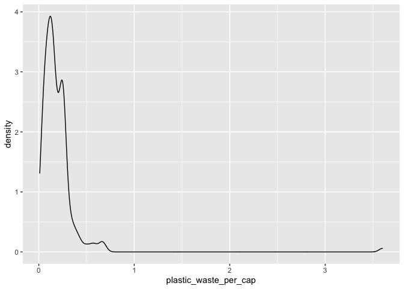
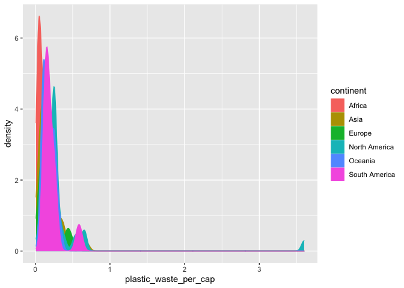
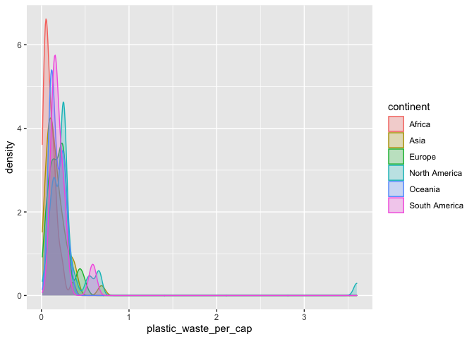
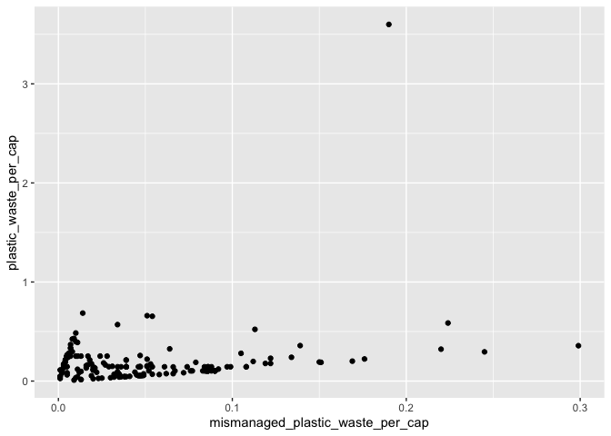
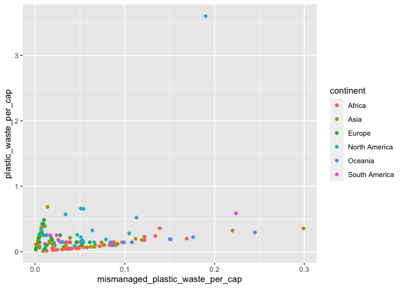
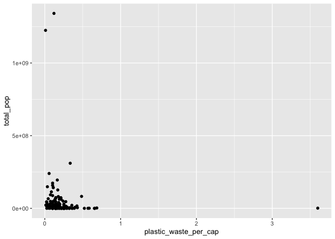
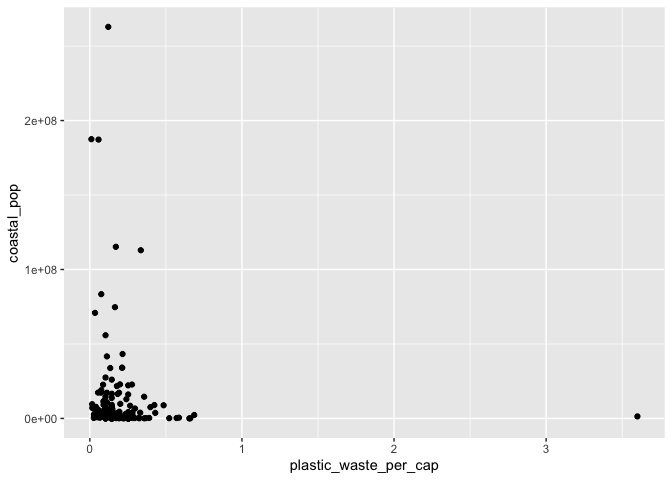

Lab 02 - Plastic waste
================
Marq Schieber
2/13/22

## Load packages and data

``` r
library(tidyverse) 
```

``` r
plastic_waste <- read.csv("data/plastic-waste.csv")
```

## Exercises

### Exercise 1

``` r
ggplot(data = plastic_waste, aes(x = plastic_waste_per_cap)) +
  geom_histogram(binwidth = 0.2) +
  facet_wrap(~ continent)
```

    ## Warning: Removed 51 rows containing non-finite values (stat_bin).

<!-- -->

``` r
ggplot(data = plastic_waste, aes(x = plastic_waste_per_cap)) +
  geom_density()
```

    ## Warning: Removed 51 rows containing non-finite values (stat_density).

<!-- -->

``` r
ggplot(data = plastic_waste, 
       mapping = aes(x = plastic_waste_per_cap, 
                     color = continent, 
                     fill = continent)) +
  geom_density()
```

    ## Warning: Removed 51 rows containing non-finite values (stat_density).

<!-- -->

They all look relatively similar. Asia and North America appear to have
the most waste per capita.

### Exercise 2

``` r
ggplot(data = plastic_waste, 
       mapping = aes(x = plastic_waste_per_cap, 
                     color = continent, 
                     fill = continent)) +
  geom_density(alpha = 0.25)
```

    ## Warning: Removed 51 rows containing non-finite values (stat_density).

<!-- -->

### Exercise 3

Is it because color and fill relate directly to variables in the data
set, whereas the alpha

### Exercise 4

``` r
ggplot(data = plastic_waste, 
       mapping = aes(x = continent, 
                     y = plastic_waste_per_cap)) +
  geom_violin()
```

    ## Warning: Removed 51 rows containing non-finite values (stat_ydensity).

<!-- -->

First time seeing this type of graph. Does a better job showing where
countries within each continent cluster. For example, more countries in
Africa are low in waste per capita, whereas there are ore countries in
North America that are ‘higher’ in waste per capita than countries that
are low.

### Exercise 5

Visualize the relationship between plastic waste per capita and
mismanaged plastic waste per capita using a scatterplot. Describe the
relationship.

``` r
ggplot(data = plastic_waste,
           mapping = aes(x = mismanaged_plastic_waste_per_cap,
                         y = plastic_waste_per_cap)) + 
  geom_point()
```

    ## Warning: Removed 51 rows containing missing values (geom_point).

<!-- -->

There appears to be a sharp linear trend.

### Exercise 6

``` r
ggplot(data = plastic_waste,
           mapping = aes(x = mismanaged_plastic_waste_per_cap,
                         y = plastic_waste_per_cap,
                         color = continent,
                         fill = continent)) + 
  geom_point()
```

    ## Warning: Removed 51 rows containing missing values (geom_point).

<!-- -->

It appears that for Africa and Europe, as mismanagement increases,
plastic waste increases.

### Exercise 7

Visualize the relationship between plastic waste per capita and total
population as well as plastic waste per capita and coastal population.
You will need to make two separate plots. Do either of these pairs of
variables appear to be more strongly linearly associated?

``` r
ggplot(data = plastic_waste,
           mapping = aes(x = plastic_waste_per_cap,
                         y = total_pop)) +
  geom_point()
```

    ## Warning: Removed 61 rows containing missing values (geom_point).

<!-- -->

``` r
ggplot(data = plastic_waste,
           mapping = aes(x = plastic_waste_per_cap,
                         y = coastal_pop)) +
  geom_point()
```

    ## Warning: Removed 51 rows containing missing values (geom_point).

<!-- -->

### Exercise 8

Remove this text, and add your answer for Exercise 8 here.

``` r
# insert code here
```

## Pro-Tips

### Excercise 3

Try this :D

ggplot(data = plastic_waste, mapping = aes(x = continent, y =
plastic_waste_per_cap)) + geom_violin()+ geom_boxplot(width=.3,
fill=“green”) + stat_summary(fun.y=median, geom=“point”)

### Exercise 5

Helpful
reference:<http://www.sthda.com/english/wiki/ggplot2-themes-and-background-colors-the-3-elements>
